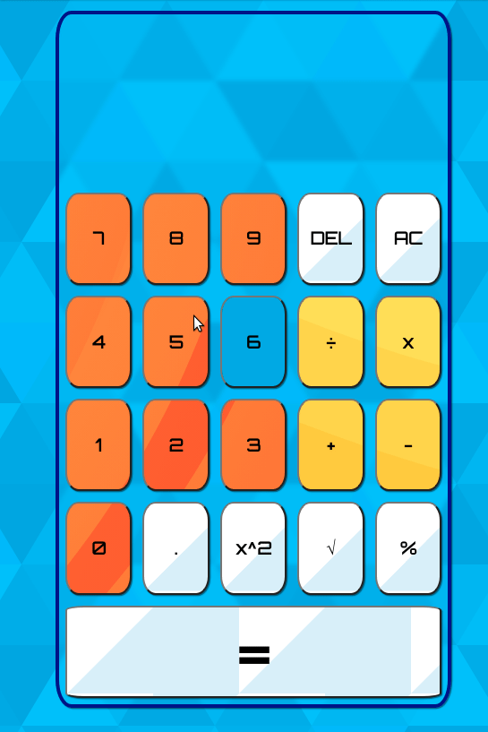

# Calculator with basic functionality to practice HTML/CSS/JS
  https://nilryan.github.io/calculator/
  
## Learning Outcomes:
  1. Basic UI using css grid
  2. Arrays, DOM manipulation, Event delegation 
